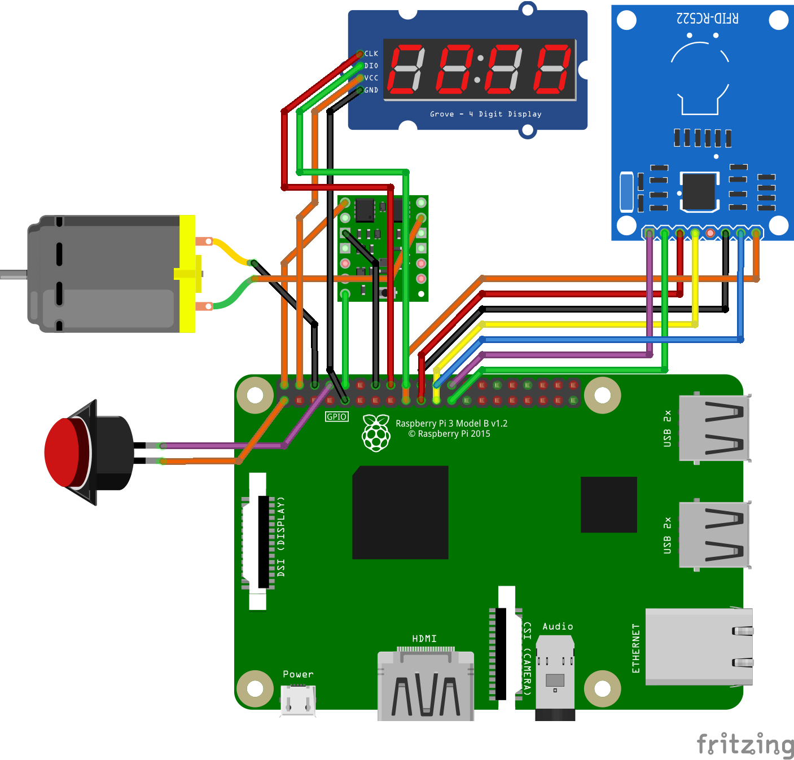
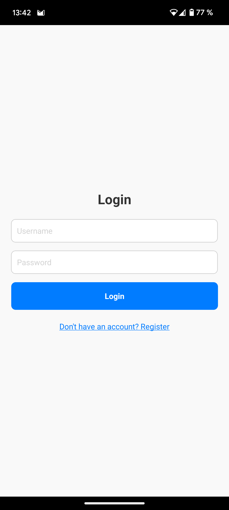
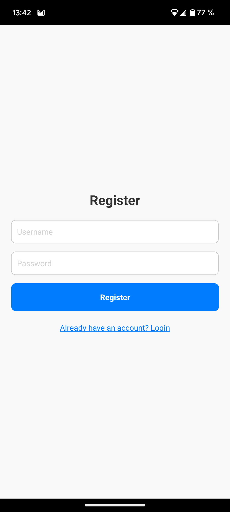
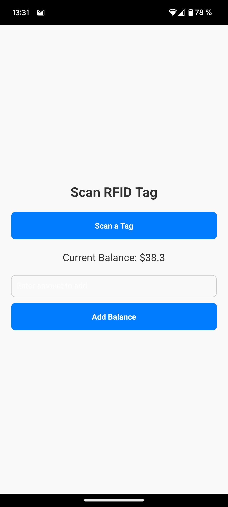
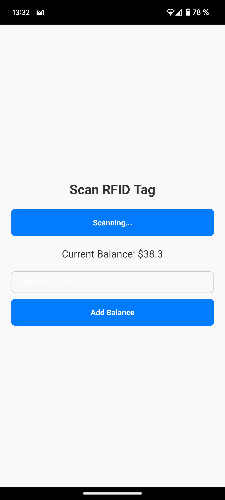
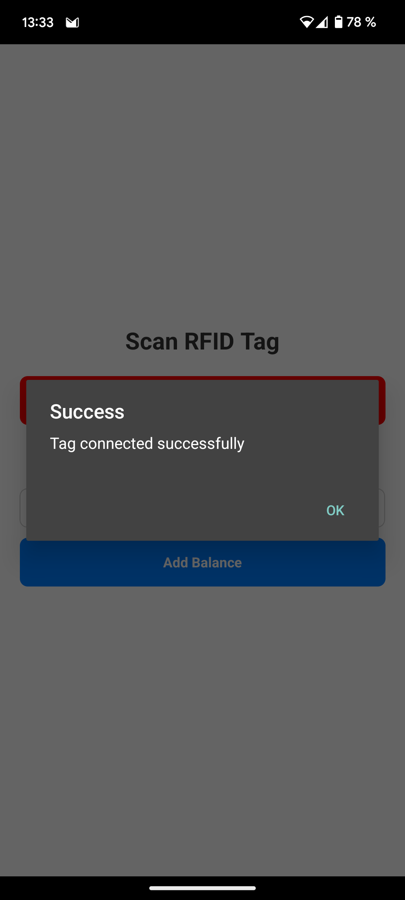
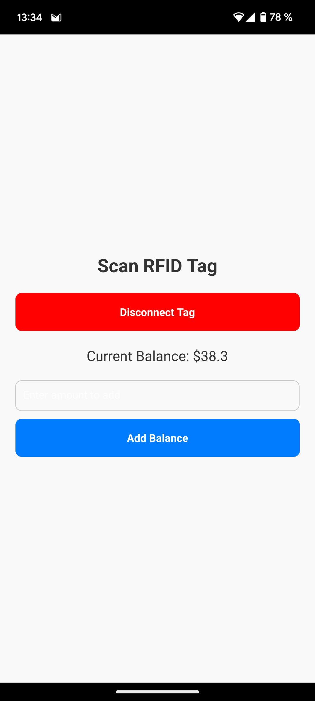
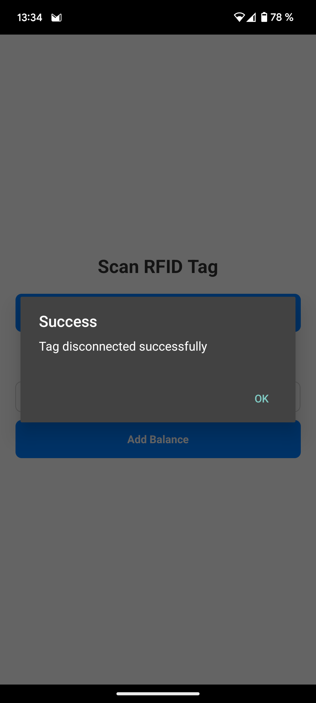
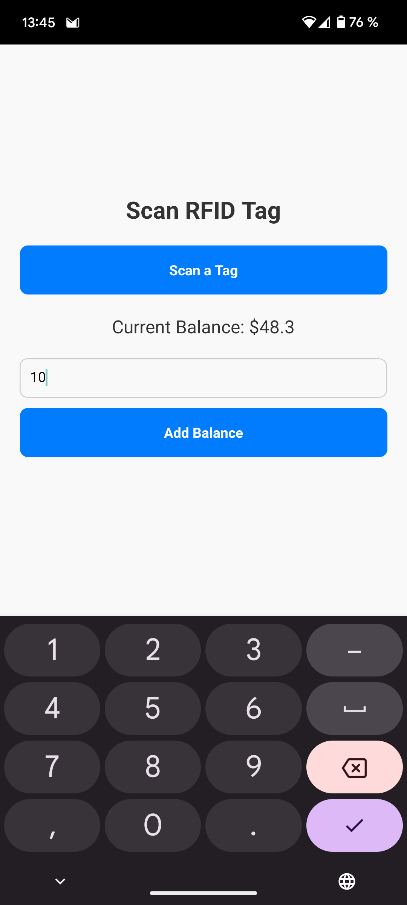
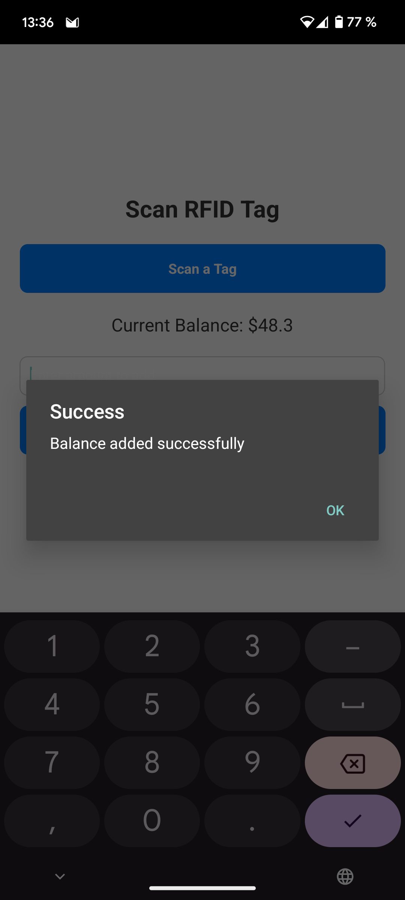

# FlashDrink : Distributeur de boisson facturé à l'unité

## Description du projet

Le projet FlashDrink vise à concevoir un distributeur de boissons connecté et autonome, pour des environnements comme les espaces de restauration en libre-service ou les espaces communs.
Ce système propose une interface utilisateur simple etergonomique, qui permet à l'utilisateur de choisir sa quantité de boisson, évitant ainsi le gachis alimentaire. 

L'utilisateur obtient un goblet connecté, qui peut être associé à son compte.
Une fois son goblet associé, le système se charge de débiter automatiquement le compte de l'utilisateur en fonction de sa consommation.

## Matériel utilisé

- **Microcontrolleur** : [Raspberry Pi 3 Model B](https://www.raspberrypi.com/products/raspberry-pi-3-model-b/), **40.00€**.

- **Connecteur récipient** : Lecteur RFID [MFRC522](https://www.google.com/search?q=MFRC522), **7.00€**.

- **Afficheur** : 7-Display [TM1637](https://www.google.com/search?q=TM1637), **7.00€**.

- **Distribution du liquide** : Pompe submergée, **3.80€**.

- **Interaction utilisateur** : Bouton classique d'arcade, **3.70€**.

- **MOSFET** : [Pololu Power Switch](https://www.pololu.com/product/2808), **3.95€**.

- **Circuit** : câblage électrique et tube étanche, **4.00€**.

- **Impression 3D** : 400 grammes de PLA, **8.00€**.

Au total, le prix du matériel utilisé s'élève à **77.45€**

## Installation


### Backend - Installation

On commence par se connecter à la machine qui va héberger le backend, par SSH ou par interface graphique.
Puis, dans un terminal, on se déplace dans le dossier `backend` du dépot github, et on exécute les étapes suivantes :

1. **Installez `UV`**
```
curl -LsSf https://astral.sh/uv/install.sh | sh
```

2. **Créez un environnement virtuel (venv)**

```
uv venv
```

3. **Installez les dépendances**

```uv pip sync requirements.txt```

4. **Exécutez le backend**

```
source venv/bin/activate
gunicorn --workers 4 --bind 0.0.0.0:5000 app:app
```

5. (Optionnel) **Ajoutez le backend en tant que service Linux avec `systemctl`**

Placez ce qui suit (et modifiez-le si nécessaire) dans `/etc/systemd/system/flask-drink-payment.service` :

```
[Unit]
Description=Flash Drink Payment System
After=network.target

[Service]
User=ubuntu
WorkingDirectory=/home/ubuntu/objetconnecte
ExecStart=/home/ubuntu/objetconnecte/venv/bin/gunicorn --workers 4 --bind 0.0.0.0:5000 app:app
Restart=always
Environment="PATH=/home/ubuntu/objetconnecte/venv/bin"
Environment="PYTHONUNBUFFERED=1"

[Install]
WantedBy=multi-user.target
```

Ensuite, redémarrez les services avec `sudo systemctl enable flash-drink-payment` et `sudo systemctl daemon-reload`

Pour accéder à l'application, rendez-vous sur [http://localhost:5000](http://localhost:5000). 
Si vous voulez y accéder depuis un autre appareil, il faut nécessairement ouvrir les ports de son réseau pour rediriger les requêtes du port 5000 vers la machine qui héberge ce script.


### Système embarqué - Installation

Pour exécuter le script sur le microcontrolleur du système embarqué, on utilise la même méthode que pour lancer le backend.
On commence par se connecter au microcontrolleur, par SSH ou par interface graphique.
Puis, dans un terminal, on se déplace dans le dossier `raspberry` du dépot github, et on exécute les étapes suivantes :

1. **Installez `UV`**
```
curl -LsSf https://astral.sh/uv/install.sh | sh
```

2. **Créez un environnement virtuel (venv)**

```
uv venv
```

3. **Installez les dépendances**

```uv pip sync requirements.txt```

4. **Exécutez le script**

```
source venv/bin/activate
```

```
python main.py
```

5. (Optionnel) **Ajoutez le script en tant que service Linux avec `systemctl`**

Placez ce qui suit (et modifiez-le si nécessaire) dans `/etc/systemd/system/flask-drink-embedded.service` :

```
[Unit]
Description=Flash Drink Embedded System
After=network.target

[Service]
User=flashdrink
WorkingDirectory=/home/flashdrink/dev/FlashDrink/raspberry
ExecStart=/home/flashdrink/dev/FlashDrink/raspberry/venv/bin/python /home/flashdrink/dev/FlashDrink/raspberry/main.py
Restart=always
Environment="PATH=/home/flashdrink/dev/FlashDrink/raspberry/venv/bin"
Environment="PYTHONUNBUFFERED=1"

[Install]
WantedBy=multi-user.target
```

Ensuite, redémarrez les services avec `sudo systemctl enable flask-drink-embedded` et `sudo systemctl daemon-reload`

Le script se lancera au démarage du Raspberry Pi 3.

Pour brancher les composants, suivre le diagramme suivant : 



### Application mobile - Installation

**Nous conseillons très fortement de simplement télécharger l'application, qui se trouve dans [l'onglet release du git](https://github.com/Nebulea-dev/FlashDrink/releases/latest).**
Build l'application demande de nombreuses dépendances, beaucoup de configuration et des efforts de debug assez significatifs, parce que React Native est pas toujours très sympathique.

Si vous souhaitez tout de même build l'application vous même, alors suivez les instructions ci-dessous. 
Dans un premier temps, on se place dans le dossier `mobile-app` du dépot github, puis :

1. **Installez les dépendances**

Allez sur la [documentation de React Native](https://reactnative.dev/docs/set-up-your-environment) pour voir comment installer `node`, `JDK`, `Android Studio`, `Android SDK`, et comment les configurer

2. **Configurer l'application en mode Release**

Allez sur cet [article Medium](https://medium.com/@tywosemail/building-an-apk-file-for-a-react-native-android-project-involves-several-steps-e97d1294aafc) qui explique comment générer les clés publiques et privées de l'application, et où les placer

3. **Build l'application**

Exécutez le script `build.sh`, qui va générer l'APK `app-release.apk` à la racine du dossier `mobile-app`.

## Manuel d'utilisation

### Connexion

Un utilisateur lance l'application FlashDrink sur son smartphone. Il a le choix entre se connecter ou bien créer un compte. S'il possède déjà un compte, il peut se connecter avec ses identifiants



Si l'utilisateur n'a pas de compte, il peut cliquer sur le lien `Don't have an account? Register`. Cela le mène vers la page d'inscription, où il peut créer ses indentifiants



### Synchronisation

Une fois connecté sur l'applicaiton, l'utilisateur peut faire 2 actions : synchroniser son goblet à son compte, ou ajouter du solde à son compte.



Pour relier son goblet à son compte, il clique sur le bouton `Scan a Tag` qui fait passer l'application en mode "Scan de tag RFID". 



Lorsque l'utilisateur place le goblet sur le scanneur RFID de son smartphone (souvent placé à l'arrière du smartphone), l'application l'informe que le tag a été scanné avec succès.



Il peut à présent choisir de déconnecter son compte du tag en cliquant sur le bouton `Disconnect Tag`



Si l'utilisateur clique sur ce  bouton, l'application l'informe que le tag a bien été déconnecté



### Ajout de solde

Pour ajouter du solde à son compte, l'utilisateur peut rentrer un nombre dans le champ textuel, puis appuyer sur le bouton `Add Balance`



Lorsque l'utilisateur clique sur ce bouton, l'applicaiton l'informe que le solde a bien été ajouté



### Interaction avec le distributeur

L’utilisateur positionne son récipient sur le distributeur, se distribue lui-même la quantité souhaitée, et voit son solde restant s’afficher en temps réel.

https://github.com/user-attachments/assets/1016d74c-b476-4518-9d06-095db83a6a90

## Liens

- [Github](https://github.com/Nebulea-dev/FlashDrink)
- [Wiki](https://github.com/Nebulea-dev/FlashDrink/wiki)
