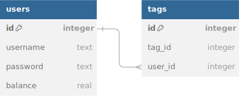

# Backend Flash Drink

## Installation

On commence par se connecter à la machine qui va héberger le backend, par SSH ou par interface graphique.
Puis, dans un terminal, on se déplace dans le dossier `backend` du dépot github, et on exécute les étapes suivantes :

1. **Installez `UV`**
```
curl -LsSf https://astral.sh/uv/install.sh | sh
```

2. **Créez un environnement virtuel (venv)**

```
uv venv
```

3. **Installez les dépendances**

```uv pip sync requirements.txt```

4. **Exécutez le backend**

```
source venv/bin/activate
gunicorn --workers 4 --bind 0.0.0.0:5000 app:app
```

5. (Optionnel) **Ajoutez le backend en tant que service Linux avec `systemctl`**

Placez ce qui suit (et modifiez-le si nécessaire) dans `/etc/systemd/system/flask-drink-payment.service` :

```
[Unit]
Description=Flash Drink Payment System
After=network.target

[Service]
User=ubuntu
WorkingDirectory=/home/ubuntu/objetconnecte
ExecStart=/home/ubuntu/objetconnecte/venv/bin/gunicorn --workers 4 --bind 0.0.0.0:5000 app:app
Restart=always
Environment="PATH=/home/ubuntu/objetconnecte/venv/bin"
Environment="PYTHONUNBUFFERED=1"

[Install]
WantedBy=multi-user.target
```

Ensuite, redémarrez les services avec `sudo systemctl enable flash-drink-payment` et `sudo systemctl daemon-reload`

Pour accéder à l'application, rendez-vous sur [http://localhost:5000](http://localhost:5000). 
Si vous voulez y accéder depuis un autre appareil, il faut nécessairement ouvrir les ports de son réseau pour rediriger les requêtes du port 5000 vers la machine qui héberge ce script.

## Fonctionnement

L'API du Système de Paiement RFID Flask permet aux utilisateurs de :
- Enregistrer et authentifier les comptes utilisateurs.
- Associer des étiquettes RFID aux utilisateurs.
- Effectuer des transactions liées au solde, comme ajouter et retirer des fonds.

L'API communique avec une base de données SQLite pour stocker les informations des utilisateurs, les associations de tags RFID et les soldes.

#### Structure de la base de données

La base de données est construit autour de 2 tables : `users` et `tags`. La première table doit contenir les informations sur les utilisateurs, comme leurs identifiants et leur solde. La seconde table est une table d'association qui indique quels tags sont associés à quels utilisateurs.

Voici un schéma de la base de données :



Et voici des informations plus détaillées sur chaque champs :

- **users** : Stocke les informations des utilisateurs.
  - `id` : Identifiant unique pour l'utilisateur.
  - `username` : Nom de l'utilisateur (unique).
  - `password` : Mot de passe haché.
  - `balance` : Solde du compte de l'utilisateur.

- **tags** : Stocke les associations de tag RFID.
  - `tag_id` : Identifiant unique pour le tag RFID.
  - `user_id` : ID de l'utilisateur associé au tag.


#### Routes de l'API

L'API REST est un script python qui utilise la librairie `Flask` pour facilement créer un serveur web qui réponds en JSON sur un total de 8 routes différentes.

##### 1. **Enregistrer un utilisateur**

**Point de terminaison** : `/registerUser`  
**Méthode** : `POST`  
**Description** : Enregistre un nouvel utilisateur avec un nom d'utilisateur et un mot de passe.

**Corps de la requête** :

```json
{
  "username": "string",
  "password": "string"
}
```

**Réponses** :
- `201` : Utilisateur enregistré avec succès.
- `400` : Le nom d'utilisateur existe déjà ou des champs requis sont manquants.

##### 2. **Connecter un utilisateur (Se connecter)**

**Point de terminaison** : `/connectUser`  
**Méthode** : `POST`  
**Description** : Authentifie un utilisateur avec un nom d'utilisateur et un mot de passe.

**Corps de la requête** :

```json
{
  "username": "string",
  "password": "string"
}
```

**Réponses** :
- `200` : Utilisateur connecté avec succès avec l'ID de l'utilisateur.
- `401` : Nom d'utilisateur ou mot de passe invalide.
- `400` : Champs requis manquants.

##### 3. **Connecter un tag RFID à un utilisateur**

**Point de terminaison** : `/connectTagWithUser`  
**Méthode** : `POST`  
**Description** : Lie un tag RFID à un utilisateur.

**Corps de la requête** :

```json
{
  "tag_id": "string",
  "user_id": "integer"
}
```

**Réponses** :

- `200` : L'étiquette a été connectée à l'utilisateur avec succès.
- `400` : Champs requis manquants.

##### 4. **Déconnecter un tag RFID**

**Point de terminaison** : `/disconnectTag`  
**Méthode** : `POST`  
**Description** : Délie un tag RFID de tout utilisateur associé.

**Corps de la requête** :

```json
{
  "tag_id": "string"
}
```

**Réponses** :

- `200` : Le tag a été déconnectée avec succès.
- `400` : Champs requis manquants.

##### 5. **Ajouter du solde**

**Point de terminaison** : `/addBalance`  
**Méthode** : `POST`  
**Description** : Ajoute du solde au compte d'un utilisateur à l'aide d'un tag RFID.

**Corps de la requête** :

```json
{
  "tag_id": "string",
  "amount": "float"
}
```

**Réponses** :

- `200` : La balance a été ajoutée avec succès.
- `400` : Champs requis manquants.
- `404` : Le tag n'est pas associée à un utilisateur.

##### 6. **Définir le solde**

**Point de terminaison** : `/setBalance`  
**Méthode** : `POST`  
**Description** : Définit le solude du compte d'un utilisateur à l'aide d'un tag RFID.

**Corps de la requête** :

```json
{
  "tag_id": "string",
  "amount": "float"
}
```

**Réponses** :

- `200` : La balance a été définie avec succès.
- `400` : Champs requis manquants.
- `404` : Le tag n'est pas associée à un utilisateur.

##### 7. **Obtenir la balance d'un utilisateur**

**Point de terminaison** : `/getBalance`  
**Méthode** : `GET`  
**Description** : Récupère la balance d'un utilisateur.

**Paramètres de requête** :

- `user_id` : ID de l'utilisateur.

**Réponses** :

- `200` : Retourne la balance de l'utilisateur.
- `400` : Champs requis manquants.
- `404` : Utilisateur introuvable.

##### 8. **Obtenir l'utilisateur d'un tag**

**Point de terminaison** : `/getUserOfTag`  
**Méthode** : `GET`  
**Description** : Récupère l'utilisateur associé à un tag.

**Paramètres de requête** :

- `tag_id` : ID du tag.

**Réponses** :

- `200` : Retourne l'utilisateur associé au tag.
- `400` : Champs requis manquants.
- `404` : Étiquette introuvable.
