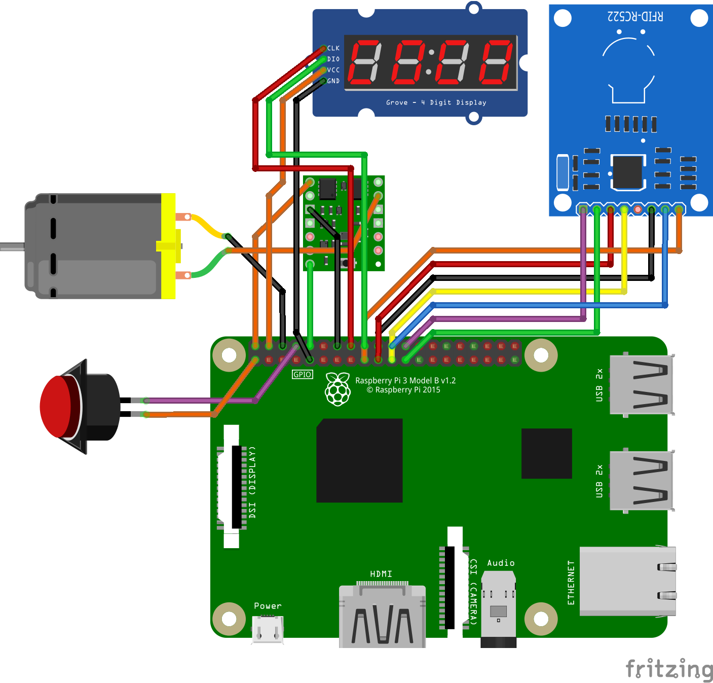
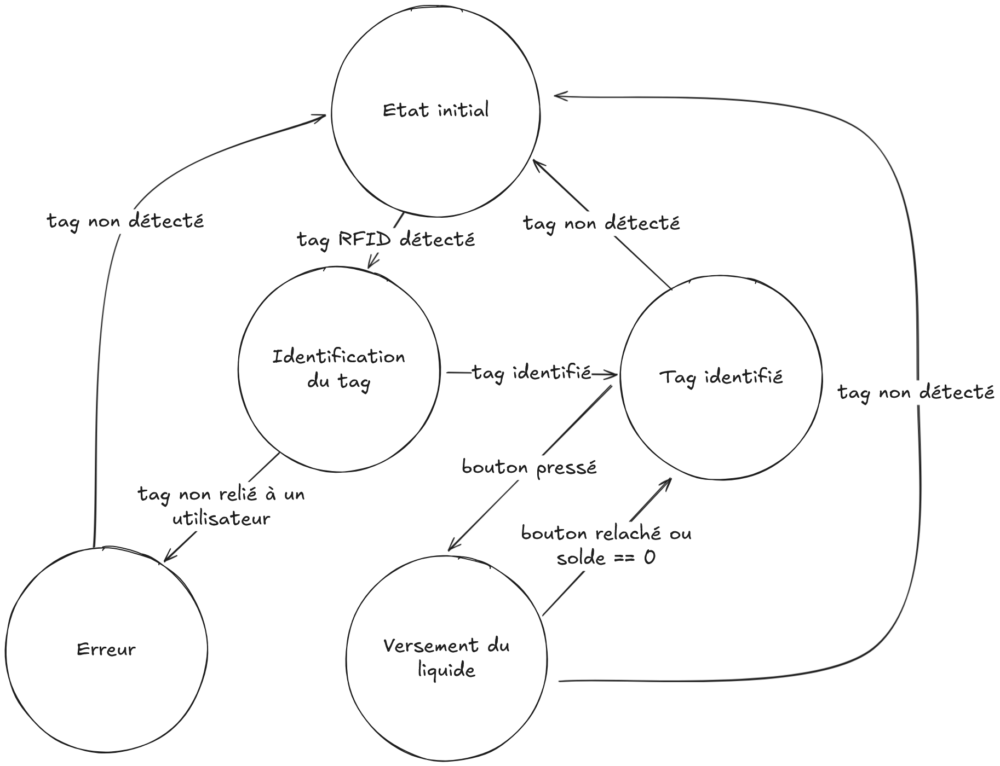

# Système embarqué Flash Drink

## Installation

Pour exécuter le script sur le microcontrolleur du système embarqué, on utilise la même méthode que pour lancer le backend.
On commence par se connecter au microcontrolleur, par SSH ou par interface graphique.
Puis, dans un terminal, on se déplace dans le dossier `raspberry` du dépot github, et on exécute les étapes suivantes :

1. **Installez `UV`**
```
curl -LsSf https://astral.sh/uv/install.sh | sh
```

2. **Créez un environnement virtuel (venv)**

```
uv venv
```

3. **Installez les dépendances**

```uv pip sync requirements.txt```

4. **Exécutez le script**

```
source venv/bin/activate
```

```
python main.py
```

5. (Optionnel) **Ajoutez le script en tant que service Linux avec `systemctl`**

Placez ce qui suit (et modifiez-le si nécessaire) dans `/etc/systemd/system/flask-drink-embedded.service` :

```
[Unit]
Description=Flash Drink Embedded System
After=network.target

[Service]
User=flashdrink
WorkingDirectory=/home/flashdrink/dev/FlashDrink/raspberry
ExecStart=/home/flashdrink/dev/FlashDrink/raspberry/venv/bin/python /home/flashdrink/dev/FlashDrink/raspberry/main.py
Restart=always
Environment="PATH=/home/flashdrink/dev/FlashDrink/raspberry/venv/bin"
Environment="PYTHONUNBUFFERED=1"

[Install]
WantedBy=multi-user.target
```

Ensuite, redémarrez les services avec `sudo systemctl enable flask-drink-embedded` et `sudo systemctl daemon-reload`

Le script se lancera au démarage du Raspberry Pi 3.

Pour brancher les composants, suivre le diagramme suivant : 



## Fonctionnement

Le système embarqué dans le distributeur de boisson est constitué de 7 composants différents :

- Un raspberry pi 3
- Un lecteur RFID
- Un tag RFID
- Une pompe submergée
- Un bouton
- Un afficheur 7-Display
- Un composant "MOSFET"

Le bouton est le seul moyen pour l'utilisateur d'intéragir avec le distributeur directement, autre qu'avec l'application mobile.

L'afficheur 7-Display permet de voir la quantité de crédits restant sur le compte de l'utilisateur. Chaque crédit compte pour un centime d'euro.

Le lecteur RFID permet de scanner un tag RFID pour lier le goblet au compte de son utilisateur.

#### Raspberry pi 3

Le raspberry pi 3 est le composant central du distributeur. C'est celui qui possède tout le code, et qui interface avec les autre composants pour faire fonctionner le distributeur.

Plusieurs autres microcontrolleurs ont été essayés avant de passer au raspberry pi 3, comme l'Arduino Yun Mini, et le Raspberry Pi Zero. Cependant, le fonctionnement de la connexion sans fil de ces microcontrolleurs s'est avérée trop difficile à configurer. Le raspberry pi 3 a le bon goût d'avoir un port HDMI qui permet de facilement configurer la connexion sans fil avec l'interface graphique. 

Le système d'exploitation utilisé sur la raspberry pi 3 est `raspbian` à la version du `2024-11-19`. Cela permet d'avoir une version à jour de Debian, de python, et d'autres dépendances essentielles.

#### Programme du distributeur

Le programme du distributeur est écrit en python pour plusieurs raisons :
- Simplicité d'utilisation, à la fois dans le code et dans l'installation des dépendances en une commande.
- Très large pannel de dépendances prêtes à l'emploi, comme celle du lecteur RFID et du 7-Display.
- Possibilité d'envoyer des requêtes HTTP vers l'API très simplement avec le package `requests`.

Le code est divisé en plusieurs fichiers, un pour chaque composant ou fonctionalité du distributeur : 
- `API.py` pour les requêtes HTTP vers l'API.
- `Button.py` pour détecter si le bouton est appuyé ou non.
- `Display.py` pour configurer quoi afficher sur le 7-Display.
- `Pump.py` pour envoyer ou non du courant dans la pompe grâce au MOSFET
- `RFID.py` pour la détection et la lecture de tags par le lecteur RFID.

Et enfin, `main.py` contient le programme principal, qui utilise les méthodes des classes de ces différents composants pour faire fonctionner le distributeur.

#### Automate d'état

Le programme principal fonctionne avec un automate d'états qui décrit les différents états dans lequel peut être le distributeur, et comment transitionner d'un état à l'autre.

Voici l'automate d'états :



#### Branchements et explication des composants

Les différents composants sont reliés au raspberry pi 3 à travers les différents pins de celui-ci. Voici un résumé des rôles de chaque pin du raspberry pi 3 :


Voici comment les branchements des différents composants sont faits :

- Les fils oranges sont du courant de 3.3V ou 5V.
- Les fils noirs sont la masse
- Les fils violets sont des fils de GPIO en mode écoute
- Les fils vers sont des fils de GPIO en mode écriture


On remarque deux choses : premièrement, le bouton et le lecteur RFID sont des composants indépendants du reste du distributeur. 
Ces derniers lisent une entrée qui est envoyée sur un pin GPIO en mode écoute, qui peut ensuite être lu par le programme. 
Enfin, la pompe n'est pas alimentée directement. A la place, son courant vient d'un MOSFET qui ne laisse passer de courant que si le pin GPIO vert est allumé.
